# Auth Service UML図

## 概要

Auth ServiceのUML図を用いたシステム設計ドキュメントです。クラス図、シーケンス図、コンポーネント図、アーキテクチャ図を通じて、システムの構造と動作を視覚的に表現しています。

---

## 1. システムアーキテクチャ図

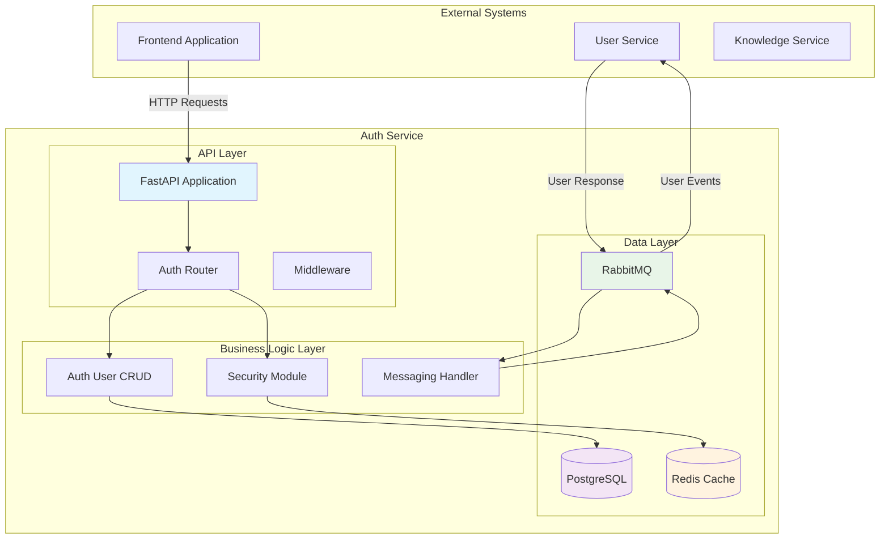
```mermaid
graph TB
    subgraph "External Systems"
        Frontend[Frontend Application]
        UserService[User Service]
        KnowledgeService[Knowledge Service]
    end
    
    subgraph "Auth Service"
        subgraph "API Layer"
            FastAPI[FastAPI Application]
            AuthRouter[Auth Router]
            Middleware[Middleware]
        end
        
        subgraph "Business Logic Layer"
            AuthCRUD[Auth User CRUD]
            Security[Security Module]
            Messaging[Messaging Handler]
        end
        
        subgraph "Data Layer"
            Database[(PostgreSQL)]
            Redis[(Redis Cache)]
            RabbitMQ[RabbitMQ]
        end
    end
    
    Frontend -->|HTTP Requests| FastAPI
    FastAPI --> AuthRouter
    AuthRouter --> AuthCRUD
    AuthRouter --> Security
    AuthCRUD --> Database
    Security --> Redis
    Messaging --> RabbitMQ
    RabbitMQ -->|User Events| UserService
    UserService -->|User Response| RabbitMQ
    RabbitMQ --> Messaging
    
    style FastAPI fill:#e1f5fe
    style Database fill:#f3e5f5
    style Redis fill:#fff3e0
    style RabbitMQ fill:#e8f5e8
```

---

## 2. クラス図

### 2.1 モデル層

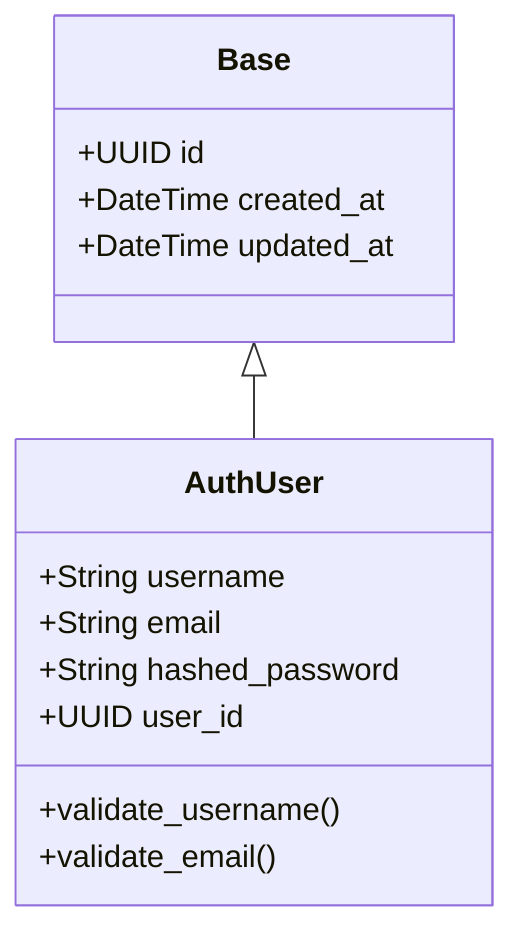
```mermaid
classDiagram
    class Base {
        +UUID id
        +DateTime created_at
        +DateTime updated_at
    }
    
    class AuthUser {
        +String username
        +String email
        +String hashed_password
        +UUID user_id
        +validate_username()
        +validate_email()
    }
    
    Base <|-- AuthUser
```

### 2.2 スキーマ層

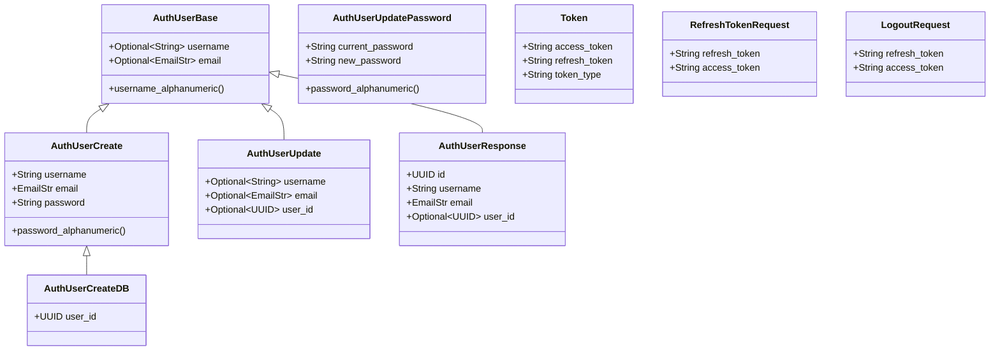
```mermaid
classDiagram
    class AuthUserBase {
        +Optional~String~ username
        +Optional~EmailStr~ email
        +username_alphanumeric()
    }
    
    class AuthUserCreate {
        +String username
        +EmailStr email
        +String password
        +password_alphanumeric()
    }
    
    class AuthUserCreateDB {
        +UUID user_id
    }
    
    class AuthUserUpdate {
        +Optional~String~ username
        +Optional~EmailStr~ email
        +Optional~UUID~ user_id
    }
    
    class AuthUserUpdatePassword {
        +String current_password
        +String new_password
        +password_alphanumeric()
    }
    
    class AuthUserResponse {
        +UUID id
        +String username
        +EmailStr email
        +Optional~UUID~ user_id
    }
    
    class Token {
        +String access_token
        +String refresh_token
        +String token_type
    }
    
    class RefreshTokenRequest {
        +String refresh_token
        +String access_token
    }
    
    class LogoutRequest {
        +String refresh_token
        +String access_token
    }
    
    AuthUserBase <|-- AuthUserCreate
    AuthUserCreate <|-- AuthUserCreateDB
    AuthUserBase <|-- AuthUserUpdate
    AuthUserBase <|-- AuthUserResponse
```

### 2.3 CRUD層

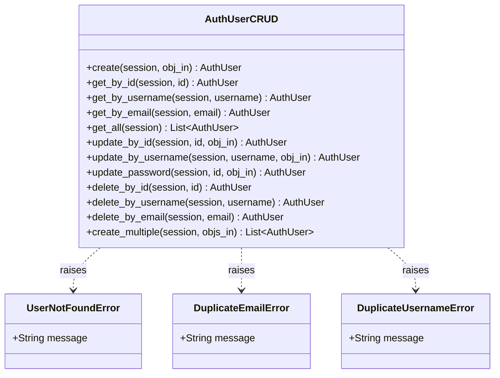
```mermaid
classDiagram
    class AuthUserCRUD {
        +create(session, obj_in) AuthUser
        +get_by_id(session, id) AuthUser
        +get_by_username(session, username) AuthUser
        +get_by_email(session, email) AuthUser
        +get_all(session) List~AuthUser~
        +update_by_id(session, id, obj_in) AuthUser
        +update_by_username(session, username, obj_in) AuthUser
        +update_password(session, id, obj_in) AuthUser
        +delete_by_id(session, id) AuthUser
        +delete_by_username(session, username) AuthUser
        +delete_by_email(session, email) AuthUser
        +create_multiple(session, objs_in) List~AuthUser~
    }
    
    class UserNotFoundError {
        +String message
    }
    
    class DuplicateEmailError {
        +String message
    }
    
    class DuplicateUsernameError {
        +String message
    }
    
    AuthUserCRUD ..> UserNotFoundError : raises
    AuthUserCRUD ..> DuplicateEmailError : raises
    AuthUserCRUD ..> DuplicateUsernameError : raises
```

### 2.4 セキュリティ層

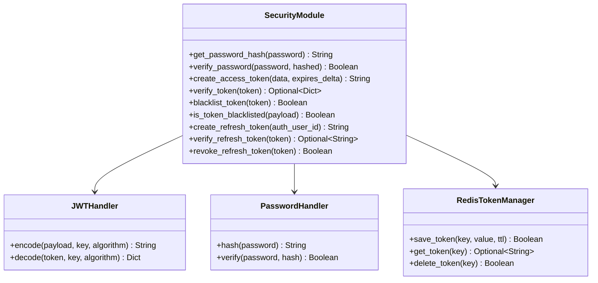
```mermaid
classDiagram
    class SecurityModule {
        +get_password_hash(password) String
        +verify_password(password, hashed) Boolean
        +create_access_token(data, expires_delta) String
        +verify_token(token) Optional~Dict~
        +blacklist_token(token) Boolean
        +is_token_blacklisted(payload) Boolean
        +create_refresh_token(auth_user_id) String
        +verify_refresh_token(token) Optional~String~
        +revoke_refresh_token(token) Boolean
    }
    
    class JWTHandler {
        +encode(payload, key, algorithm) String
        +decode(token, key, algorithm) Dict
    }
    
    class PasswordHandler {
        +hash(password) String
        +verify(password, hash) Boolean
    }
    
    class RedisTokenManager {
        +save_token(key, value, ttl) Boolean
        +get_token(key) Optional~String~
        +delete_token(key) Boolean
    }
    
    SecurityModule --> JWTHandler
    SecurityModule --> PasswordHandler
    SecurityModule --> RedisTokenManager
```

### 2.5 API層

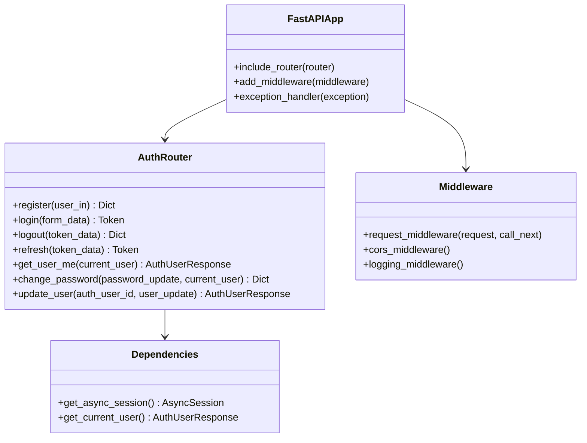
```mermaid
classDiagram
    class FastAPIApp {
        +include_router(router)
        +add_middleware(middleware)
        +exception_handler(exception)
    }
    
    class AuthRouter {
        +register(user_in) Dict
        +login(form_data) Token
        +logout(token_data) Dict
        +refresh(token_data) Token
        +get_user_me(current_user) AuthUserResponse
        +change_password(password_update, current_user) Dict
        +update_user(auth_user_id, user_update) AuthUserResponse
    }
    
    class Dependencies {
        +get_async_session() AsyncSession
        +get_current_user() AuthUserResponse
    }
    
    class Middleware {
        +request_middleware(request, call_next)
        +cors_middleware()
        +logging_middleware()
    }
    
    FastAPIApp --> AuthRouter
    FastAPIApp --> Middleware
    AuthRouter --> Dependencies
```

---

## 3. シーケンス図

### 3.1 ユーザー登録フロー

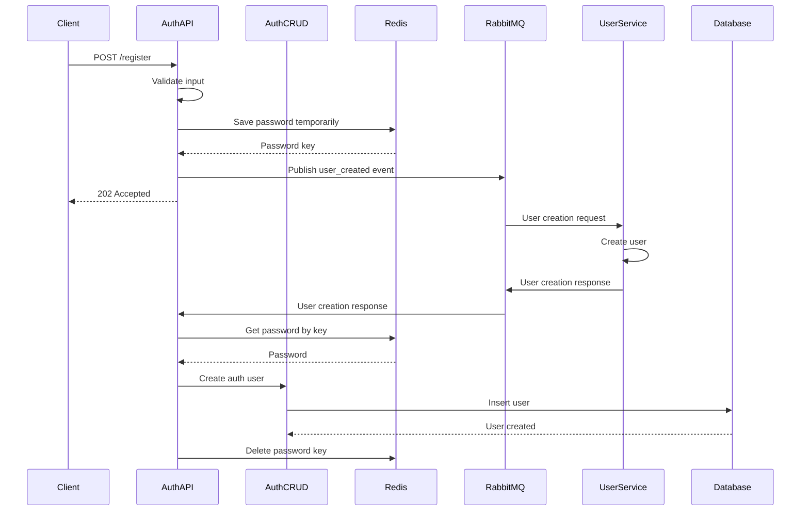
```mermaid
sequenceDiagram
    participant Client
    participant AuthAPI
    participant AuthCRUD
    participant Redis
    participant RabbitMQ
    participant UserService
    
    Client->>AuthAPI: POST /register
    AuthAPI->>AuthAPI: Validate input
    AuthAPI->>Redis: Save password temporarily
    Redis-->>AuthAPI: Password key
    AuthAPI->>RabbitMQ: Publish user_created event
    AuthAPI-->>Client: 202 Accepted
    
    RabbitMQ->>UserService: User creation request
    UserService->>UserService: Create user
    UserService->>RabbitMQ: User creation response
    
    RabbitMQ->>AuthAPI: User creation response
    AuthAPI->>Redis: Get password by key
    Redis-->>AuthAPI: Password
    AuthAPI->>AuthCRUD: Create auth user
    AuthCRUD->>Database: Insert user
    Database-->>AuthCRUD: User created
    AuthAPI->>Redis: Delete password key
```

### 3.2 ログインフロー

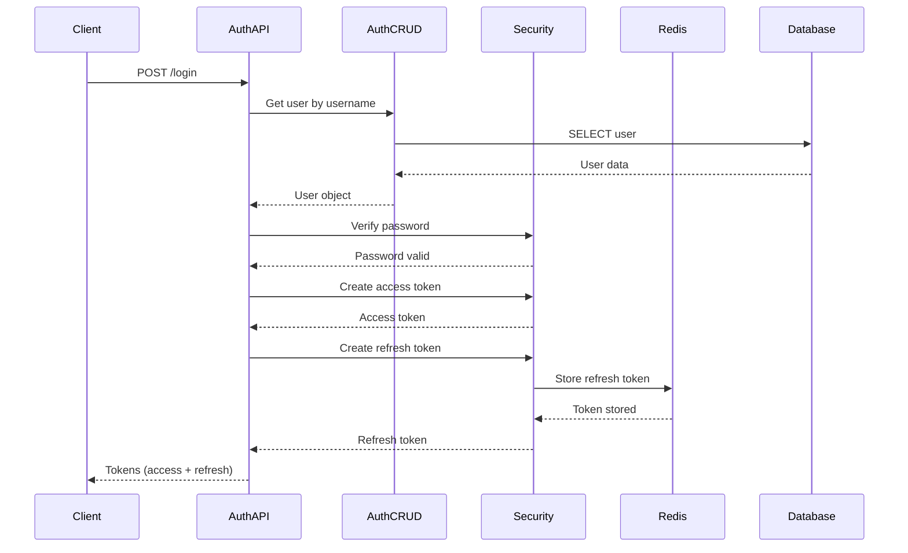
```mermaid
sequenceDiagram
    participant Client
    participant AuthAPI
    participant AuthCRUD
    participant Security
    participant Redis
    participant Database
    
    Client->>AuthAPI: POST /login
    AuthAPI->>AuthCRUD: Get user by username
    AuthCRUD->>Database: SELECT user
    Database-->>AuthCRUD: User data
    AuthCRUD-->>AuthAPI: User object
    
    AuthAPI->>Security: Verify password
    Security-->>AuthAPI: Password valid
    
    AuthAPI->>Security: Create access token
    Security-->>AuthAPI: Access token
    
    AuthAPI->>Security: Create refresh token
    Security->>Redis: Store refresh token
    Redis-->>Security: Token stored
    Security-->>AuthAPI: Refresh token
    
    AuthAPI-->>Client: Tokens (access + refresh)
```

### 3.3 トークンリフレッシュフロー

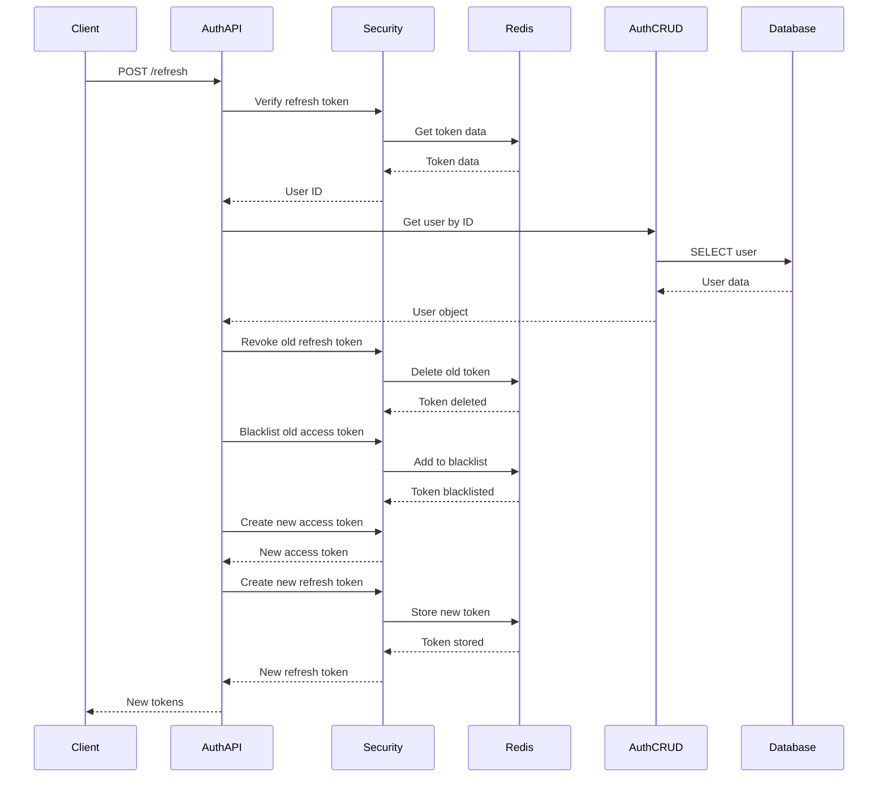
```mermaid
sequenceDiagram
    participant Client
    participant AuthAPI
    participant Security
    participant Redis
    participant AuthCRUD
    participant Database
    
    Client->>AuthAPI: POST /refresh
    AuthAPI->>Security: Verify refresh token
    Security->>Redis: Get token data
    Redis-->>Security: Token data
    Security-->>AuthAPI: User ID
    
    AuthAPI->>AuthCRUD: Get user by ID
    AuthCRUD->>Database: SELECT user
    Database-->>AuthCRUD: User data
    AuthCRUD-->>AuthAPI: User object
    
    AuthAPI->>Security: Revoke old refresh token
    Security->>Redis: Delete old token
    Redis-->>Security: Token deleted
    
    AuthAPI->>Security: Blacklist old access token
    Security->>Redis: Add to blacklist
    Redis-->>Security: Token blacklisted
    
    AuthAPI->>Security: Create new access token
    Security-->>AuthAPI: New access token
    
    AuthAPI->>Security: Create new refresh token
    Security->>Redis: Store new token
    Redis-->>Security: Token stored
    Security-->>AuthAPI: New refresh token
    
    AuthAPI-->>Client: New tokens
```

### 3.4 ログアウトフロー

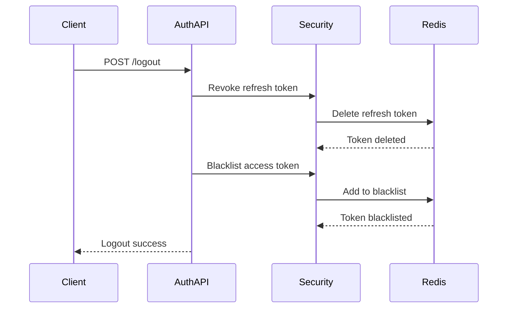
```mermaid
sequenceDiagram
    participant Client
    participant AuthAPI
    participant Security
    participant Redis
    
    Client->>AuthAPI: POST /logout
    AuthAPI->>Security: Revoke refresh token
    Security->>Redis: Delete refresh token
    Redis-->>Security: Token deleted
    
    AuthAPI->>Security: Blacklist access token
    Security->>Redis: Add to blacklist
    Redis-->>Security: Token blacklisted
    
    AuthAPI-->>Client: Logout success
```

---

## 4. コンポーネント図

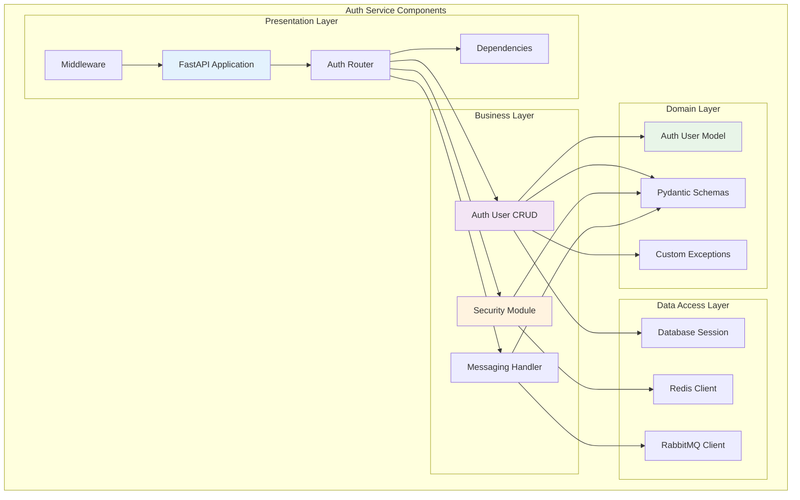
```mermaid
graph TB
    subgraph "Auth Service Components"
        subgraph "Presentation Layer"
            API[FastAPI Application]
            Router[Auth Router]
            Deps[Dependencies]
            MW[Middleware]
        end
        
        subgraph "Business Layer"
            CRUD[Auth User CRUD]
            SEC[Security Module]
            MSG[Messaging Handler]
        end
        
        subgraph "Data Access Layer"
            DB[Database Session]
            REDIS[Redis Client]
            MQ[RabbitMQ Client]
        end
        
        subgraph "Domain Layer"
            MODEL[Auth User Model]
            SCHEMA[Pydantic Schemas]
            EXC[Custom Exceptions]
        end
    end
    
    API --> Router
    Router --> Deps
    Router --> CRUD
    Router --> SEC
    Router --> MSG
    
    CRUD --> DB
    CRUD --> MODEL
    CRUD --> SCHEMA
    CRUD --> EXC
    
    SEC --> REDIS
    SEC --> SCHEMA
    
    MSG --> MQ
    MSG --> SCHEMA
    
    MW --> API
    
    style API fill:#e3f2fd
    style CRUD fill:#f3e5f5
    style SEC fill:#fff3e0
    style MODEL fill:#e8f5e8
```

---

## 5. データフロー図

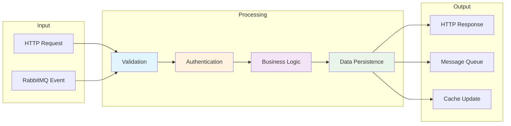
```mermaid
graph LR
    subgraph "Input"
        REQ[HTTP Request]
        EVENT[RabbitMQ Event]
    end
    
    subgraph "Processing"
        VALID[Validation]
        AUTH[Authentication]
        BIZ[Business Logic]
        PERSIST[Data Persistence]
    end
    
    subgraph "Output"
        RESP[HTTP Response]
        MSG[Message Queue]
        CACHE[Cache Update]
    end
    
    REQ --> VALID
    EVENT --> VALID
    VALID --> AUTH
    AUTH --> BIZ
    BIZ --> PERSIST
    PERSIST --> RESP
    PERSIST --> MSG
    PERSIST --> CACHE
    
    style VALID fill:#e1f5fe
    style AUTH fill:#fff3e0
    style BIZ fill:#f3e5f5
    style PERSIST fill:#e8f5e8
```

---

## 6. 状態遷移図

### 6.1 ユーザー認証状態

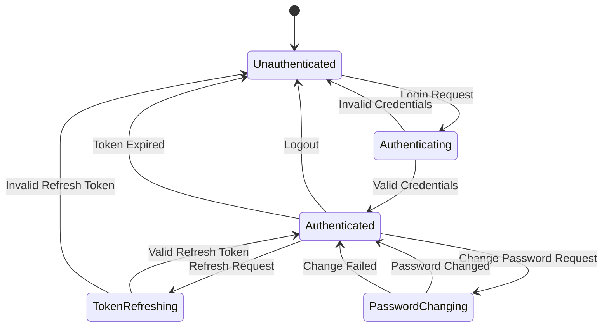
```mermaid
stateDiagram-v2
    [*] --> Unauthenticated
    
    Unauthenticated --> Authenticating : Login Request
    Authenticating --> Authenticated : Valid Credentials
    Authenticating --> Unauthenticated : Invalid Credentials
    
    Authenticated --> TokenRefreshing : Refresh Request
    TokenRefreshing --> Authenticated : Valid Refresh Token
    TokenRefreshing --> Unauthenticated : Invalid Refresh Token
    
    Authenticated --> Unauthenticated : Logout
    Authenticated --> Unauthenticated : Token Expired
    
    Authenticated --> PasswordChanging : Change Password Request
    PasswordChanging --> Authenticated : Password Changed
    PasswordChanging --> Authenticated : Change Failed
```

### 6.2 トークン状態

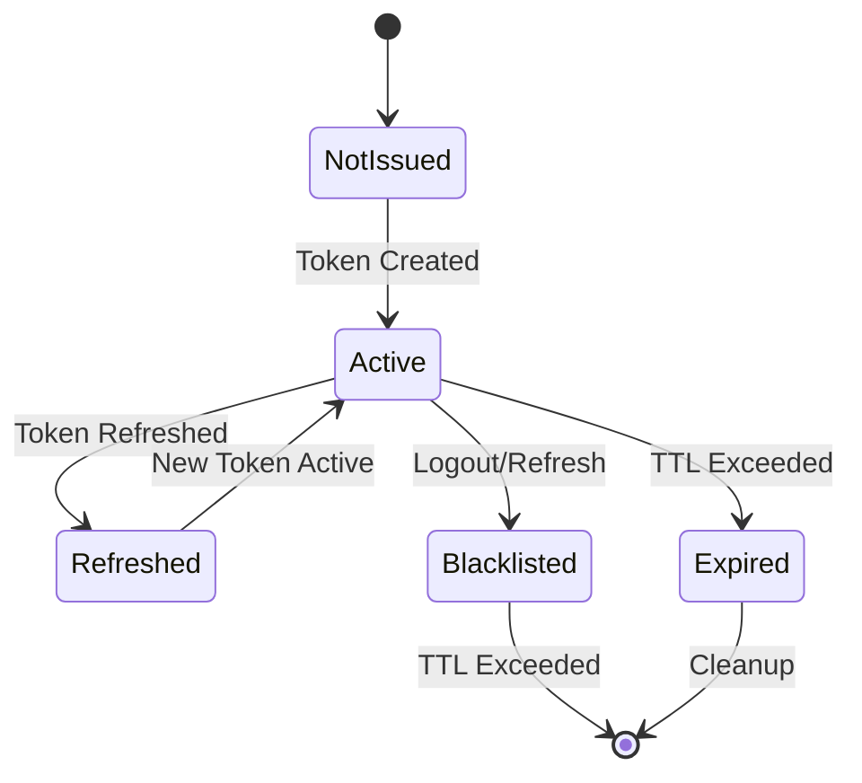
```mermaid
stateDiagram-v2
    [*] --> NotIssued
    
    NotIssued --> Active : Token Created
    Active --> Refreshed : Token Refreshed
    Active --> Blacklisted : Logout/Refresh
    Active --> Expired : TTL Exceeded
    
    Refreshed --> Active : New Token Active
    Blacklisted --> [*] : TTL Exceeded
    Expired --> [*] : Cleanup
```

---

## 7. ER図（データベース関連）

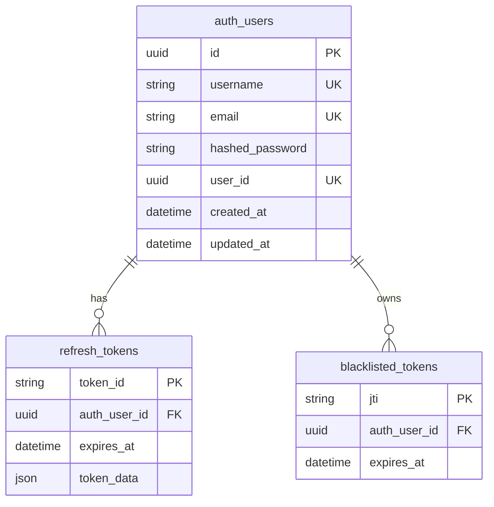
```mermaid
erDiagram
    auth_users {
        uuid id PK
        string username UK
        string email UK
        string hashed_password
        uuid user_id UK
        datetime created_at
        datetime updated_at
    }
    
    auth_users ||--o{ refresh_tokens : "has"
    auth_users ||--o{ blacklisted_tokens : "owns"
    
    refresh_tokens {
        string token_id PK
        uuid auth_user_id FK
        datetime expires_at
        json token_data
    }
    
    blacklisted_tokens {
        string jti PK
        uuid auth_user_id FK
        datetime expires_at
    }
```

---

## 8. デプロイメント図

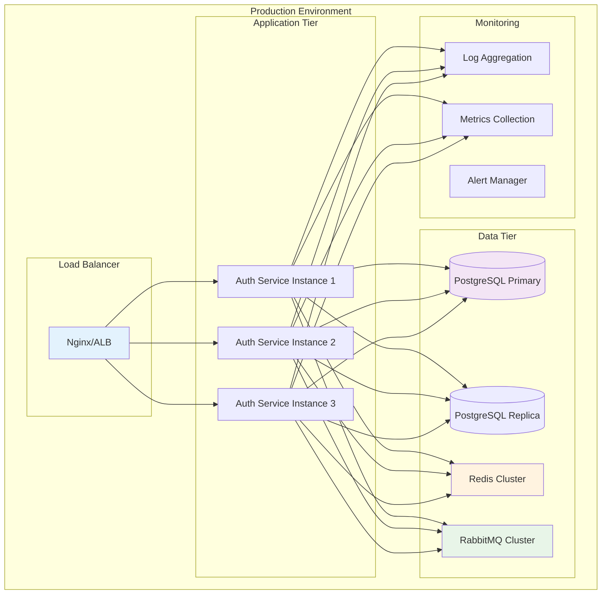
```mermaid
graph TB
    subgraph "Production Environment"
        subgraph "Load Balancer"
            LB[Nginx/ALB]
        end
        
        subgraph "Application Tier"
            APP1[Auth Service Instance 1]
            APP2[Auth Service Instance 2]
            APP3[Auth Service Instance 3]
        end
        
        subgraph "Data Tier"
            DB[(PostgreSQL Primary)]
            DB_REPLICA[(PostgreSQL Replica)]
            REDIS_CLUSTER[Redis Cluster]
            MQ_CLUSTER[RabbitMQ Cluster]
        end
        
        subgraph "Monitoring"
            LOGS[Log Aggregation]
            METRICS[Metrics Collection]
            ALERTS[Alert Manager]
        end
    end
    
    LB --> APP1
    LB --> APP2
    LB --> APP3
    
    APP1 --> DB
    APP2 --> DB
    APP3 --> DB
    
    APP1 --> DB_REPLICA
    APP2 --> DB_REPLICA
    APP3 --> DB_REPLICA
    
    APP1 --> REDIS_CLUSTER
    APP2 --> REDIS_CLUSTER
    APP3 --> REDIS_CLUSTER
    
    APP1 --> MQ_CLUSTER
    APP2 --> MQ_CLUSTER
    APP3 --> MQ_CLUSTER
    
    APP1 --> LOGS
    APP2 --> LOGS
    APP3 --> LOGS
    
    APP1 --> METRICS
    APP2 --> METRICS
    APP3 --> METRICS
    
    style LB fill:#e3f2fd
    style DB fill:#f3e5f5
    style REDIS_CLUSTER fill:#fff3e0
    style MQ_CLUSTER fill:#e8f5e8
```

---

## 9. セキュリティアーキテクチャ図

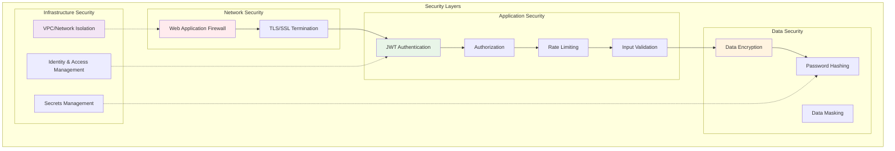
```mermaid
graph TB
    subgraph "Security Layers"
        subgraph "Network Security"
            WAF[Web Application Firewall]
            TLS[TLS/SSL Termination]
        end
        
        subgraph "Application Security"
            AUTH[JWT Authentication]
            AUTHZ[Authorization]
            RATE[Rate Limiting]
            VALID[Input Validation]
        end
        
        subgraph "Data Security"
            ENCRYPT[Data Encryption]
            HASH[Password Hashing]
            MASK[Data Masking]
        end
        
        subgraph "Infrastructure Security"
            VPC[VPC/Network Isolation]
            IAM[Identity & Access Management]
            SECRETS[Secrets Management]
        end
    end
    
    WAF --> TLS
    TLS --> AUTH
    AUTH --> AUTHZ
    AUTHZ --> RATE
    RATE --> VALID
    VALID --> ENCRYPT
    ENCRYPT --> HASH
    
    VPC -.-> WAF
    IAM -.-> AUTH
    SECRETS -.-> HASH
    
    style WAF fill:#ffebee
    style AUTH fill:#e8f5e8
    style ENCRYPT fill:#fff3e0
    style VPC fill:#f3e5f5
```

---

## 10. パフォーマンス最適化図

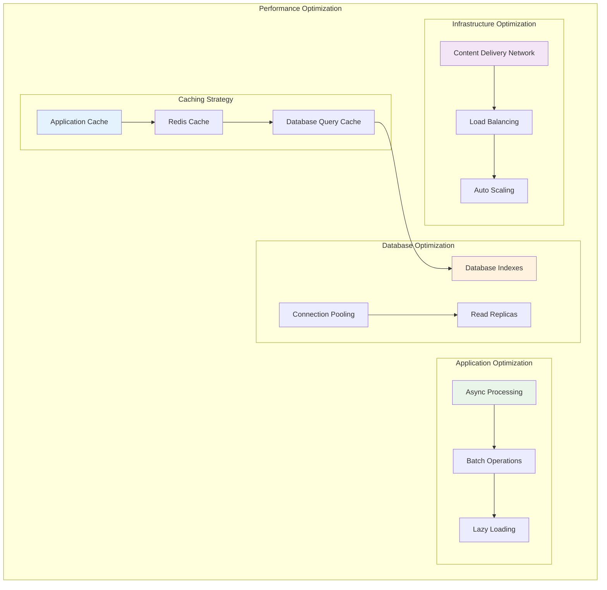
```mermaid
graph TB
    subgraph "Performance Optimization"
        subgraph "Caching Strategy"
            L1[Application Cache]
            L2[Redis Cache]
            L3[Database Query Cache]
        end
        
        subgraph "Database Optimization"
            IDX[Database Indexes]
            POOL[Connection Pooling]
            REPLICA[Read Replicas]
        end
        
        subgraph "Application Optimization"
            ASYNC[Async Processing]
            BATCH[Batch Operations]
            LAZY[Lazy Loading]
        end
        
        subgraph "Infrastructure Optimization"
            CDN[Content Delivery Network]
            LB_OPT[Load Balancing]
            AUTO[Auto Scaling]
        end
    end
    
    L1 --> L2
    L2 --> L3
    L3 --> IDX
    
    POOL --> REPLICA
    ASYNC --> BATCH
    BATCH --> LAZY
    
    CDN --> LB_OPT
    LB_OPT --> AUTO
    
    style L1 fill:#e3f2fd
    style ASYNC fill:#e8f5e8
    style IDX fill:#fff3e0
    style CDN fill:#f3e5f5
```

---

## 図の説明

### 使用目的
1. **システムアーキテクチャ図**: 全体的なシステム構成の理解
2. **クラス図**: コードの構造とクラス間の関係
3. **シーケンス図**: 処理フローとコンポーネント間の相互作用
4. **コンポーネント図**: システムの論理的な構成要素
5. **状態遷移図**: システムの状態変化
6. **ER図**: データベース設計
7. **デプロイメント図**: 本番環境での配置
8. **セキュリティアーキテクチャ図**: セキュリティ対策の全体像
9. **パフォーマンス最適化図**: 性能向上のための戦略

### 図の更新
- システムの変更に応じて図を更新
- 新機能追加時は関連する図を見直し
- アーキテクチャ変更時は全体的な整合性を確認

### 参照関係
- [テーブル設計](./table-design.md)
- [API仕様](./api-specification.md)
- [テスト仕様](./test-specification.md)
